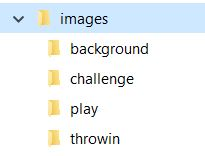
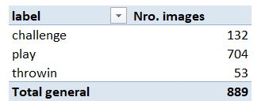

# Extracción de imagenes de un video

<font color = "blue"> Descripción de ***Image Annotation.ipynb***.</font>

Se busca extraer las imágenes del video **"1606b0e6_0.mp4"** de la competición de Kaggle [DFL - Bundesliga Data Shootout](https://www.kaggle.com/competitions/dfl-bundesliga-data-shootout). Este es un video de la data de entrenamiento, por lo que también tendremos las anotaciones disponibles en el archivo **train.csv**, que nos permitirán realizar las validaciones de las extracciones realizadas. 

Este video tiene una duración de 57'16'', loc cual convertido a segundos da una duración de 3,436 segundos aproximadamente, por lo que de este video se espera que se extraigan la misma cantidad de imágenes.

En el código desarrollado se implementa una lógica que utiliza la data dada en el archivo **train.csv** y lo toma como guía para crear la estructura del directorio dónde se almacenan la imágenes.

Estructura directorio  
 

 La raíz del directorio creado es imagenes y dentro de ella se tiene una carpeta para cada una de las clases de jugadas de fútbol (play, challenge, throwin), dónde se almacenarán la imágenes del segundo que coincidan con las anotaciones dadas en el archivo **train.csv**. Como en el video hay muchos segundos en los que no hay una jugada específica etiquetada, las imágenes recuperadas en estos casos se almacenarán la carpeta de background.

El siguiente código se desarrollo en base a:
- [DFL - Bundesliga Data Shoot Multi 28th Solution](https://www.kaggle.com/code/starfalllover/dfl-bundesliga-data-shoot-multi-28th-solution/notebook)
- [Extract a frame every second in Python](https://answers.opencv.org/question/62029/extract-a-frame-every-second-in-python/)

```python
# Cargar librerías
import glob
import os
import numpy as np
import math
import pandas as pd
import torch
import cv2
import fire
from tqdm import tqdm
torch.backends.cudnn.benchmark = True
from timm.data import ImageDataset, create_loader

# Función para leer y editar la data de las anotaciones en train.
def image_annotation(path_data):
    """
    Función para leer y editar la data de las anotaciones de jugadas en un video dado.
    path_data = Es la ruta del directorio dónde se encuentra el archivo csv.
    """
    # Leemos el archivo train.csv con las anotaciones.
    train = pd.read_csv(path_data)
    # Redondeamos time al segundo más cercano
    train['second'] = [int(np.round(x,0)) for x in train.time]
    # Construimos el id de la imagen
    train['image_id'] = train.video_id + '-second' + train.second.astype(str)
    # Construímos el label o etiqueta de cada imagen
    train['label0'] = np.where(train.event_attributes.isna(), np.nan, train.event) # Label = event is event != start or end else nan
    train['label1'] = train['label0'].fillna(method = 'backfill') # Reemplazamos na de labels por el valor anterior
    train['label2'] = train['label0'].fillna(method = 'ffill') # Reemplazamos na de labels por el valor posterior
    # Implementamos lógica de imputación 
    train['label'] = np.where(train.event == 'start', train.label1,
                            np.where(train.event=='end',train.label2, train.label0))
    # Eliminamos imagenes duplicadas.
    train = train.drop_duplicates(['image_id', 'label'], keep = 'first')
    # Seleccionamos columnas necesarias
    dict_labels = dict(zip(train.image_id, train.label))
    train = train.drop(['label0', 'label1', 'label2'], axis = 1)#[['image_id', 'label']].copy()
    return train, dict_labels

def extract_images(video_path, out_dir, img_size, dict_labels):
    """
    Función para extraer imágenes de un video, se extrae una imagen x segundo.
    video_path = Dirección del video del cual se quiere extraer los frames o imágenes.
    out_dir = directorio dónde se almacenarán la ímagenes extraídas del video.
    img_size = tamaño de las imágenes de salida.
    """
    video_name = os.path.basename(video_path).split('.')[0] # Extraemos la ruta dónde esta el video.
    cam = cv2.VideoCapture(video_path) # Preparamos para la captura
    fps = int(cam.get(cv2.CAP_PROP_FPS)) # Cantidad de FPS
    print(video_path, fps)
    frame_count = 0  # Contador
    while True:
        current_fps = int(cam.get(1)) # Frame actual
        successed, img = cam.read() # Leemos el frame actual
        # Verificamos que el frame del cual se va a generar la imagen, corresponde al segundo siguiente.
        if (current_fps % math.floor(fps)==0):
            image_id = f'{video_name}-second{int(current_fps/fps)}'
            if image_id in dict_labels.keys():
                outfile = f'{out_dir}/{dict_labels[image_id]}/{image_id}.jpg' # Archivos de salida
            else:
                outfile = f'{out_dir}/background/{image_id}.jpg' # Archivos de salida
            
            img = cv2.resize(img, dsize=img_size, interpolation=cv2.INTER_AREA) # Redimensianamos la imagen
            cv2.imwrite(outfile, img) # Guardamos la imagen
        if not successed:
            break # Si ya no hay más frames paramos
        frame_count += 1

###################

def main():
    # Leer anotaciones
    path_data = f'{HOME}/data/train.csv'
    train, dict_labels = image_annotation(path_data)

    # Construimos el directorio dónde se almacenarán las imágenes
    !mkdir -p images/background images/challenge images/play images/throwin

    # Lista de videos de entrenamiento
    train_videos = sorted(glob.glob('../data/train/*'))
    video_path = train_videos[0]
    out_dir = './images'
    img_size = (544,544)
    # Extraer imágenes y almacenarlas dónde correponda.
    extract_images(video_path, out_dir, img_size, dict_labels)

########### FUNCTION - MAIN
if __name__ == '__main__':
    fire.Fire(main)
```

 ### Validación.
 - Se debería extraer 3,436 imágenes más una del segundo 0 (Se extrajo 2,548 imágenes en background, 132 imágenes en challenge, 704 imágenes en play y 53 imágenes en throwin).  
 - En el archivo en **train.csv** para este video se encuentran la siguiente distribución de las clases:
  
